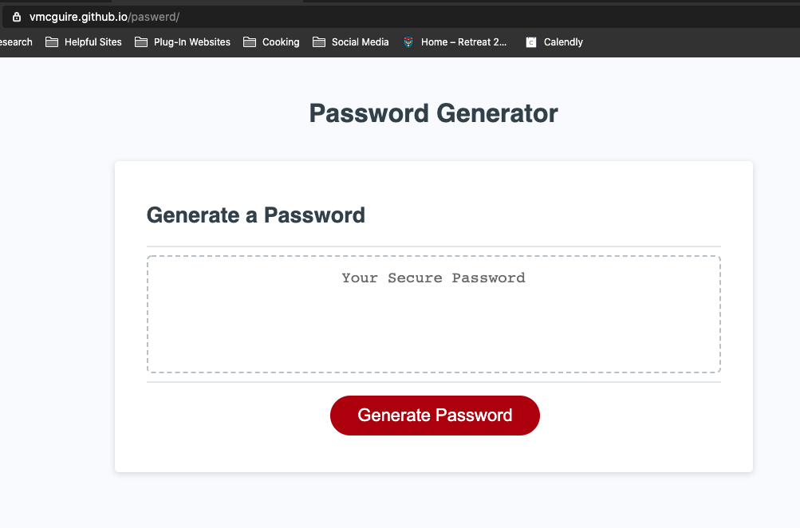
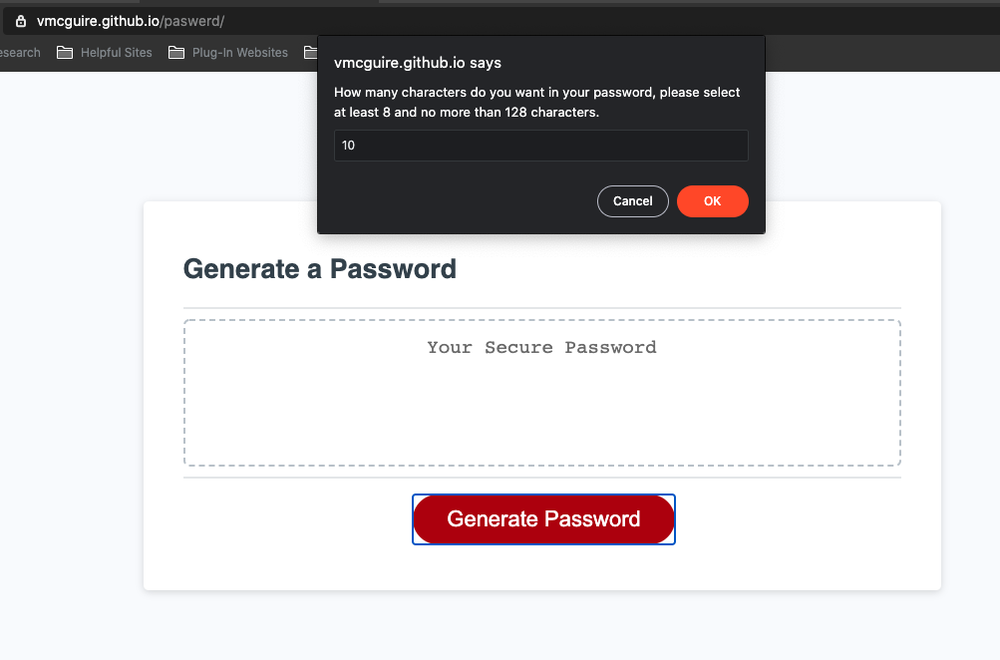
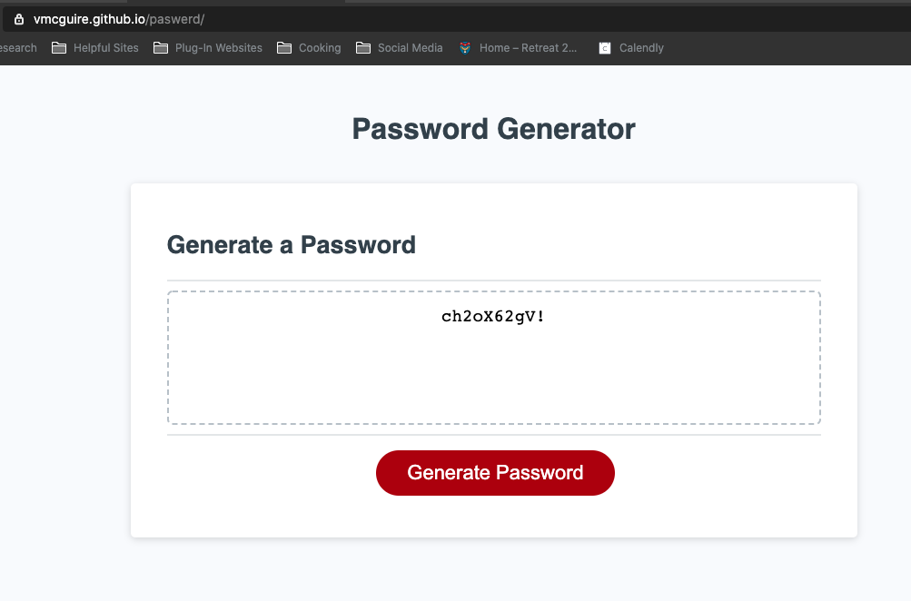

# 03 JavaScript: Password Generator (paswerd)

## A Display of My Work as a Full-Stack Developer

The purpose of this project was to create an application that generates a random password based on user-selected criteria. This app runs in the browser and feature dynamically updated HTML and CSS powered by JavaScript code. It features a clean and polished user interface and be responsive, ensuring that it adapts to multiple screen sizes.

https://vmcguire.github.io/paswerd/

## Installation

1. You can access the developer files here: https://github.com/vmcguire/paswerd
2. Download to your machine. 
3. Access just like any other html, css, and javascript file with terminal or command console and use your favorite editor to make any updates.
4. Be sure to have the other files in the assets folder downloaded also to ensure their links exist.

## Usage 

1. The first screen shot showing the interface prior to pushing the button to generate a password.

2. The first prompt that comes up after the user clicks the 'Generate Password' button. Various other prompts occur with the right error messages if the user doesn't select the correct or minimum criteria.

3. A password generated by the application.

## Credits

Collaborators included the berkeley coding bootcamp team. The original files were pulled from here:
https://ucb.bootcampcontent.com/UCB-Coding-Bootcamp/ucb-virt-bo-fsf-pt-11-2020-u-b/tree/master/03-JavaScript/02-Challenge

## License

*** Copyright (c) 2020 Victor McGuire ***

Permission is hereby granted, free of charge, to any person obtaining a copy
of this software and associated documentation files (the "Software"), to deal
in the Software without restriction, including without limitation the rights
to use, copy, modify, merge, publish, distribute, sublicense, and/or sell
copies of the Software, and to permit persons to whom the Software is
furnished to do so, subject to the following conditions:

The above copyright notice and this permission notice shall be included in all
copies or substantial portions of the Software.

THE SOFTWARE IS PROVIDED "AS IS", WITHOUT WARRANTY OF ANY KIND, EXPRESS OR
IMPLIED, INCLUDING BUT NOT LIMITED TO THE WARRANTIES OF MERCHANTABILITY,
FITNESS FOR A PARTICULAR PURPOSE AND NONINFRINGEMENT. IN NO EVENT SHALL THE
AUTHORS OR COPYRIGHT HOLDERS BE LIABLE FOR ANY CLAIM, DAMAGES OR OTHER
LIABILITY, WHETHER IN AN ACTION OF CONTRACT, TORT OR OTHERWISE, ARISING FROM,
OUT OF OR IN CONNECTION WITH THE SOFTWARE OR THE USE OR OTHER DEALINGS IN THE
SOFTWARE.

---

© 2020 Victor McGuire, Confidential and Proprietary. All Rights Reserved.
